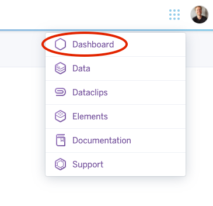
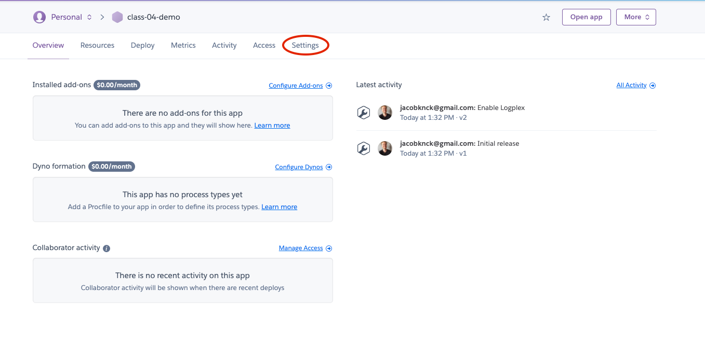

# basic-api-server

## LAB -03

### Deployment Test

- [ci/cd GitHub Actions]().
- [herokuapp Link Main ]().
- [pull request]().
- [Main Repo link]() 

## Setup 

`.env` **requirements**

- `PORT` - 3000

- `POSTGRES_URI` = Postgres DB

**Running the app**

- `npm start` , `nodemon` 

- Endpoint: `/food/1`

  - Returns Object

        {
        "foodName": "mansaf",
        "country" : "jordan" 
        }

- Endpoint: `/food/1`

  - Returns Object

        {
   "companyName":" ",
    "color":" ",
        }


**Tests**

- Unit Tests: `npm run test`

---------------------------------------------------------
UML : 


# Note  
# Express REST API

Express servers can quickly get big and out of control if you build them in one monolithic server file. There are many strategies for breaking the route handling logic into modules that "make sense" ... we'll be introducing the you to one such pattern today -- separate routers that contain all of the routing logic and handlers using `Express.router()`. In 301, we kept the route definitions in the server and imported the handler functions from other modules. There is more than one way to do it, and your applications can be seen through many lenses.

## Learning Objectives

### Students will be able to

#### Describe and Define

- External (modular) routing with Express

#### Execute

- Build a REST API server using Express.
- Use Sequelize models and schemas to perform CRUD operations.
- Respond to request Queries and Parameters in routes.
- Testing code that relies on a Postgres Database server.

## Today's Outline

<!-- To Be Completed By Instructor -->

## Notes

### CRUD Operations with REST and Express

- CREATE
  - `app.post('/resource')`
- READ
  - `app.get('/resource')`
- UPDATE
  - `app.put('/resource/:id')`
- DESTROY
  - `app.get('/resource/:id')`

### Route Modules

- Normal node modules
- Require express just like your server
- Instantiate `express.router` instead of `express()`
- Export the route definitions
- The main server/app should require your route an then `use()` them
  - The server can prefix imported routes

#### Router

```javascript
const express = require('express');

const router = express.Router();

router.get('/mystuff', (req,res) => {
  const out = {
    fromParam: req.params.color,
    fromReq: req.color,
  };
  res.send(out);
});

module.exports = router;
```

#### Server

```javascript
const express = require('express');
const app = express();

// Bring in your custom routes
const customRoutes = require('./routes.js');

// Integrate them into (use them) in the app
app.use(customRoutes);
```

### Route Prefixes

When you `use()` a router, you can prefix all of it's routes from the server.  In this example, we've prefixed the custom routes module with **/custom**, which means that calls to <http://servername.com/mystuff> will no longer work as before. You'll now have to use <http://servername.com/custom/mystuff>

```javascript
const express = require('express');
const app = express();

const customRoutes = require('./routes.js');

// now, routes in the routes file will only work if /custom is in front of them.
app.use('/custom', customRoutes);

```

### Sequelize

In order to communicate with our SQL database we will utilize the `sequelize` library and the `sequelize-cli` to communicate with our persistent data.  Use the following commands to perform database intialization and CRUD behaviors.

#### Initialize Database and Tables

Sequelize has a partner tool: `sequelize-cli` that can be used to configure our database: `npm install -g sequelize-cli`

1. Use `sequelize-cli` to intialize our project with configuration files:

```bash
$ sequelize init:config


Sequelize CLI [Node: 14.2.0, CLI: 6.2.0, ORM: 6.6.2]

Created "config/config.json"
```

1. Once our configuration files are created, we can add our database environment details:

> NOTE: make sure you modify the username, password, and database fields and well making sure `postgres` is specified in config/config.json

```json
{
  "development": {
    "username": "root",
    "password": "rootroot",
    "database": "data_development",
    "host": "127.0.0.1",
    "dialect": "postgres"
  },
  "test": {
    "username": "root",
    "password": "rootroot",
    "database": "data_test",
    "host": "127.0.0.1",
    "dialect": "postgres"
  },
  "production": {
    "username": "root",
    "password": "rootroot",
    "database": "data_production",
    "host": "127.0.0.1",
    "dialect": "postgres"
  }
}
```

1. Once our config is done we can create our database: `$ sequelize db:create`

With our database configured and created we can connect to our Database and perform sql operations:

```javascript
const Sequelize = require('sequelize');
const sequelize = new Sequlize('dialect://connection.string');


// we can initialize and reset our database once our sequelize instance is configured.

sequelize.sync(); // creates tables from all schemas associated with our sequelize instance.

sequelize.drop(); // removes tables and records.
```

#### Perform Basic SQL Operations  

```javascript

// Defines a new table in our Database
const Food = sequelze.define({
  name: {
    type: DataTypes.STRING,
    allowNull: false,
  },
  calories: {
    type: DataTypes.NUMBER,
    allowNull: true,
  }
});


Food.create({name: 'banana', calories: 200}); // Creates a new reord in our SQl table, filling in the 'name' and 'calories' columns.
Food.findAll();  // Reads a record where the id matches.

```

### Hosted Postgres Database: Heroku Postgres

When we deploy our applications we won't be able to access our local postgres database so we need to connect to a machine running Postgres in the cloud.  This will allow us to always have a running instance of Postgres, with better hardware, more memory and faster network speeds.  Heroku allows us to set up Postgres data directly through the Heroku CLI.  Once set up, we can use a url much like we've been using to connect our application to our database.

1. Log Into your Heroku Account.  

1. Create / Update your Heroku Application.
   - If you haven't already, Create a Heroku Application.  

   - If your Heroku App is already created just select your App from the Dashboard.  

1. Add `Heroku Postgres` from the `Resources` tab from the Application View.

   - Type `Heroku Postgres` in the `Add-ons` section.  

   - After selecting the Add-on, Choose the `Hobby Dev-Free` plan and submit the form.
1. Confirm that you have an Environment Variable set for your Postgres Database.
   - Click on `Settings` from the Application View

   - Under the `Config Vars` you should see a field for `DATABASE_URL` with a postgres connection string as it's value.

1. Add your DATABASE_URL to your Application!
   - Make sure you are able to access environment specific variables within your source code.  

```javascript
require('dotenv').config();

const POSTGRES_URI = process.env.DATABASE_URL;
```

   > WARNING: Sequelize will require extra config for the `DATABASE_URL` make sure you use the following config object when you deploy:

```javascript
new Sequelize(DATABASE_URL, {
  dialectOptions: {
    ssl: {
      require: true,
      rejectUnauthorized: false,
    }
  }
});
```
